# WhatsApp Clone - Technical Architecture Overview

## Executive Summary

This document provides a comprehensive technical architecture overview of the WhatsApp Clone application, a full-stack real-time messaging system built with modern web technologies.

### Technology Stack

#### Backend
- **Runtime**: Node.js with TypeScript
- **API Framework**: Apollo GraphQL Server v2.13.1
- **Web Framework**: Express.js v4.17.1
- **Database**: PostgreSQL v8.2.1
- **Database Client**: node-postgres (pg)
- **Authentication**: JWT (jsonwebtoken) with bcrypt password hashing
- **GraphQL Modules**: @graphql-modules/core v0.7.17 for modular GraphQL architecture
- **Real-time Communication**: GraphQL Subscriptions with graphql-postgres-subscriptions
- **Data Loading**: DataLoader v2.0.0 for batching and caching
- **External APIs**: Apollo DataSource REST for Unsplash API integration

#### Frontend
- **UI Framework**: React v17.0.2 with TypeScript
- **GraphQL Client**: Apollo Client v4.0.8
- **UI Components**: Material-UI v4.12.4
- **Styling**: Styled-Components v6.1.19
- **Routing**: React Router DOM v5.3.4
- **Real-time**: GraphQL Subscriptions via graphql-ws v6.0.6

#### Development & Testing
- **Testing**: Jest with ts-jest
- **Code Generation**: GraphQL Code Generator
- **Build Tool**: TypeScript Compiler, React Scripts
- **Load Testing**: Artillery

---

## System Architecture

### High-Level System Architecture

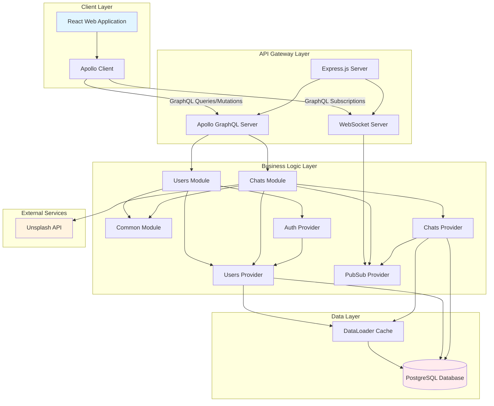

---

## Component Architecture

### GraphQL Module Architecture

The application follows a modular GraphQL architecture pattern using `@graphql-modules/core`:

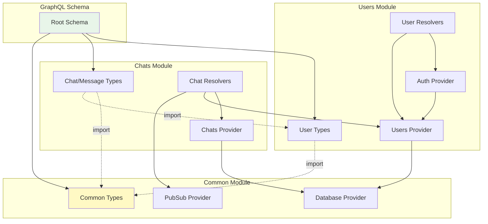

### Provider Dependency Injection

```mermaid
graph LR
    subgraph "Session Scope Providers"
        Auth[Auth Provider]
        Users[Users Provider]
        Chats[Chats Provider]
    end
    
    subgraph "Application Scope Providers"
        Database[Database Provider]
        PubSub[PubSub Provider]
    end
    
    subgraph "External Data Sources"
        Unsplash[Unsplash API DataSource]
    end
    
    Auth -->|@Inject| Users
    Chats -->|@Inject| Database
    Chats -->|@Inject| PubSub
    Users -->|@Inject| Database
    
    Resolvers[GraphQL Resolvers] -->|injector.get| Auth
    Resolvers -->|injector.get| Users
    Resolvers -->|injector.get| Chats
    Resolvers -->|dataSources| Unsplash
    
    style Auth fill:#ffcdd2
    style Users fill:#c5cae9
    style Chats fill:#b2dfdb
```

---

## Data Architecture

### Database Schema

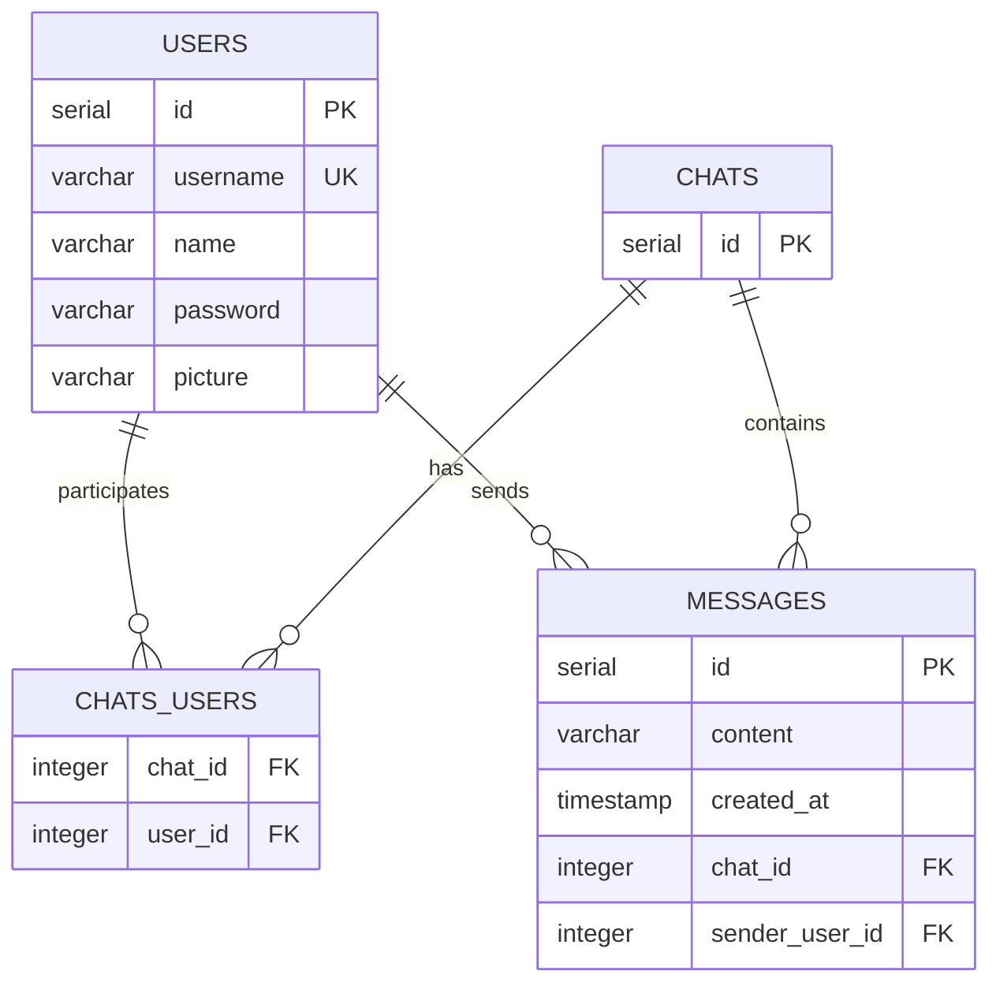

### GraphQL Type System

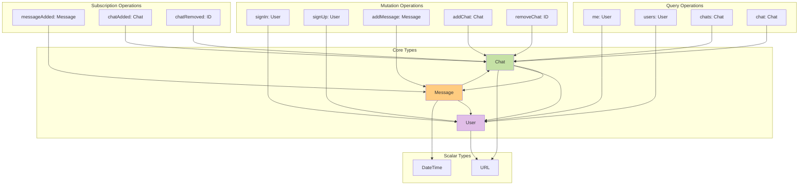

---

## Data Flow Architecture

### Authentication Flow

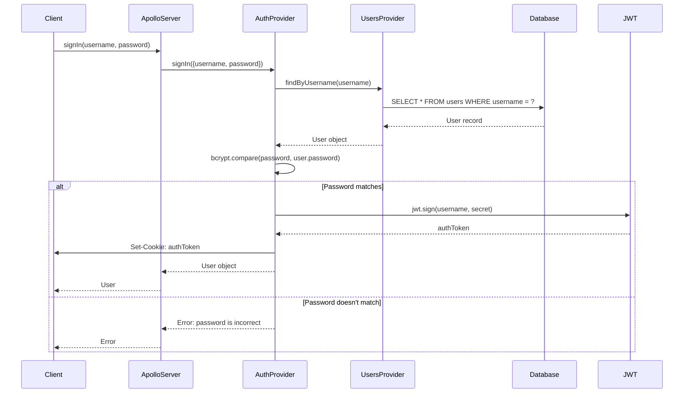

### Message Creation Flow

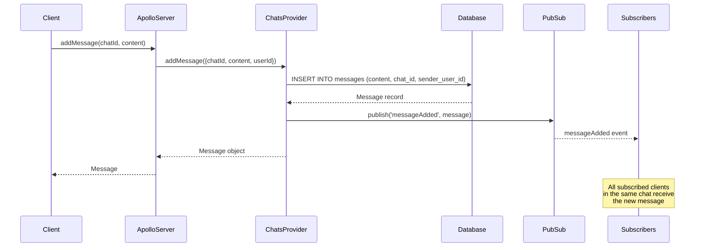

### Query with DataLoader Caching

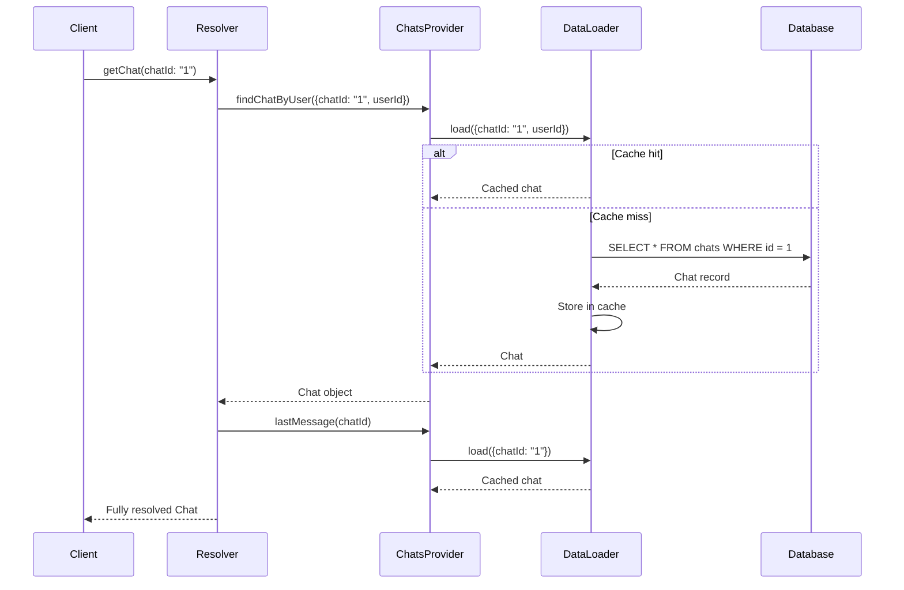

### Real-time Subscription Flow

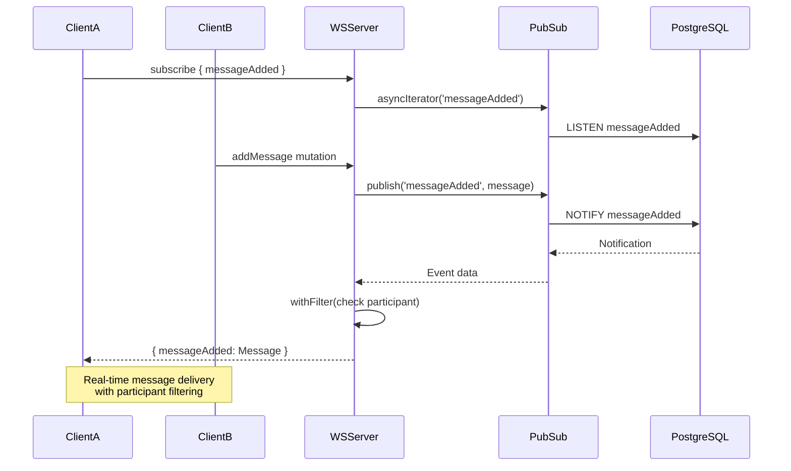

---

## Integration Architecture

### External API Integration

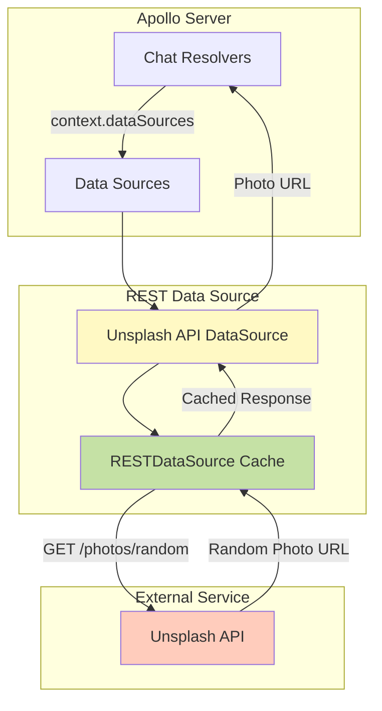

### Authentication & Authorization Flow

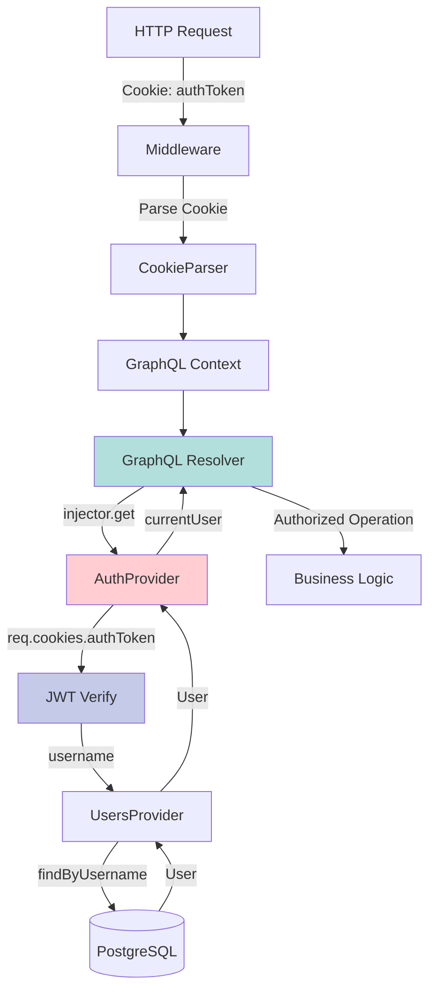

---

## Performance Architecture

### DataLoader Batching & Caching

```mermaid
graph TB
    subgraph "Single Request Cycle"
        R1[Resolver 1: Get Chat 1]
        R2[Resolver 2: Get Chat 2]
        R3[Resolver 3: Get Chat 1]
        R4[Resolver 4: Get User 5]
    end
    
    subgraph "DataLoader Layer"
        ChatLoader[Chat DataLoader]
        UserLoader[User DataLoader]
        Cache[Request-scoped Cache]
    end
    
    subgraph "Database Layer"
        DB[(PostgreSQL)]
    end
    
    R1 -->|load chatId:1| ChatLoader
    R2 -->|load chatId:2| ChatLoader
    R3 -->|load chatId:1| ChatLoader
    R4 -->|load userId:5| UserLoader
    
    ChatLoader -->|Batch: SELECT * WHERE id IN (1,2)| DB
    UserLoader -->|Batch: SELECT * WHERE id = 5| DB
    
    ChatLoader --> Cache
    R3 -.->|Cache Hit| Cache
    
    DB -->|Results| ChatLoader
    DB -->|Results| UserLoader
    
    ChatLoader --> R1
    ChatLoader --> R2
    Cache --> R3
    UserLoader --> R4
    
    style Cache fill:#c8e6c9
    style ChatLoader fill:#fff9c4
    style UserLoader fill:#ffccbc
```

### Session-based Provider Scoping

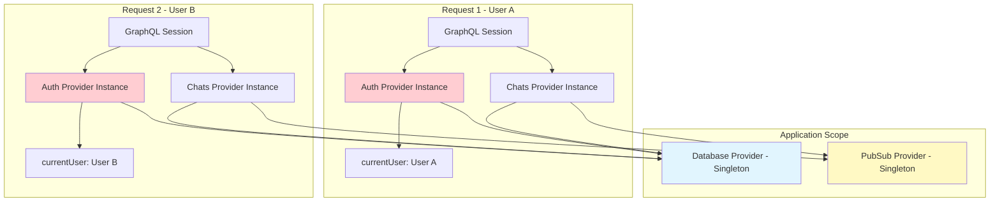

---

## Security Architecture

### Authentication Layer

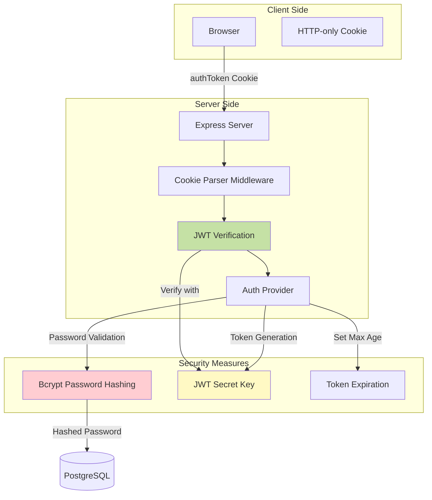

### Authorization Strategy

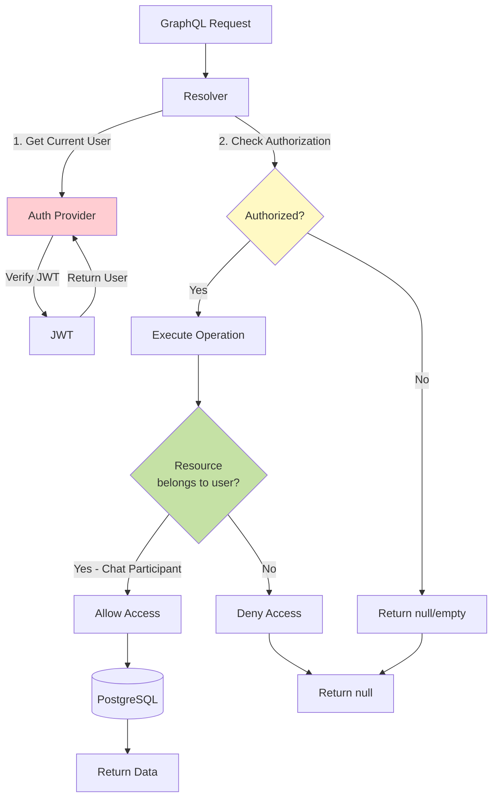

---

## Deployment Architecture

### Production Environment

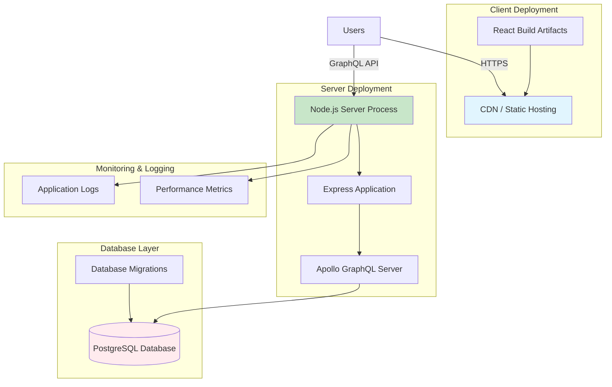

---

## Technology Decisions & Rationale

### Backend Architecture Decisions

1. **GraphQL over REST**
   - Single endpoint for all data operations
   - Strong typing with schema
   - Efficient data fetching (no over/under-fetching)
   - Real-time subscriptions support
   - Code generation for type safety

2. **GraphQL Modules Architecture**
   - Separation of concerns
   - Dependency injection for testability
   - Independent feature modules
   - Shared common functionality
   - Session-scoped providers for request isolation

3. **PostgreSQL Database**
   - ACID compliance for message consistency
   - Strong relational model for chat relationships
   - Native support for GraphQL subscriptions (LISTEN/NOTIFY)
   - Mature ecosystem and tooling

4. **DataLoader Pattern**
   - N+1 query problem mitigation
   - Request-scoped caching
   - Automatic batching of database queries
   - Performance optimization

5. **JWT Authentication**
   - Stateless authentication
   - Scalability (no server-side session storage)
   - Cross-domain support
   - Standard protocol

### Frontend Architecture Decisions

1. **React with Hooks**
   - Modern, functional component approach
   - Simplified state management
   - Better code reusability
   - Active ecosystem

2. **Apollo Client**
   - Integrated GraphQL client
   - Intelligent caching
   - Optimistic UI updates
   - Real-time subscription support
   - Normalized cache

3. **Material-UI + Styled-Components**
   - Professional UI components
   - Customizable theming
   - CSS-in-JS for component encapsulation
   - TypeScript support

4. **TypeScript**
   - Type safety across the stack
   - Better IDE support
   - Reduced runtime errors
   - GraphQL code generation integration

---

## Scalability Considerations

### Current Architecture Limitations

1. **Single Server Instance**
   - No horizontal scaling
   - Single point of failure
   - Limited by single machine resources

2. **In-Memory PubSub**
   - Not distributed across instances
   - Requires sticky sessions or external PubSub

3. **Session-based DataLoader**
   - Cache limited to request scope
   - No cross-request caching

### Scalability Improvements

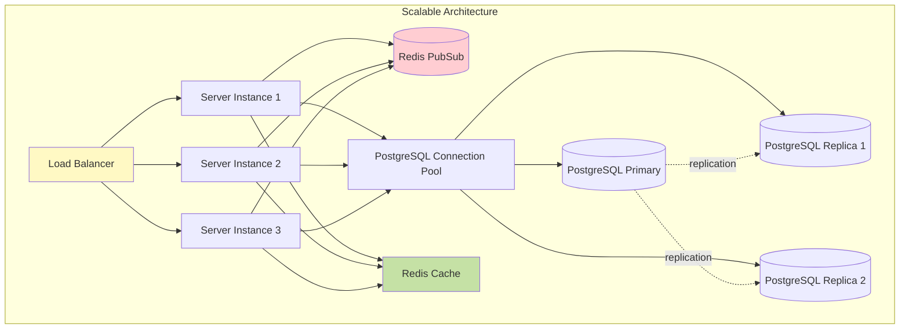

---

## System Invariants & Constraints

### Data Integrity Invariants

1. **User Uniqueness**: Each username must be unique across the system
2. **Message Ownership**: Every message must belong to exactly one chat and have exactly one sender
3. **Chat Participation**: A chat must have at least 2 participants (enforced at application level)
4. **Authentication Requirement**: All mutations (except signIn/signUp) require authenticated user
5. **Authorization**: Users can only access chats they participate in

### Performance Constraints

1. **Message Pagination**: Messages fetched with limit to prevent large payloads
2. **DataLoader Batching**: Database queries batched per request cycle
3. **Connection Pooling**: PostgreSQL connections managed via pool

### Security Constraints

1. **Password Storage**: Passwords stored as bcrypt hashes, never plaintext
2. **JWT Expiration**: Authentication tokens have configurable expiration
3. **HTTP-only Cookies**: Auth tokens stored in HTTP-only cookies to prevent XSS
4. **Input Validation**: Username, password, and name fields validated for length and format

---

## Future Architecture Enhancements

1. **Microservices Migration**
   - Separate auth, chat, and user services
   - Independent scaling and deployment
   - Service mesh for inter-service communication

2. **Event Sourcing**
   - Immutable event log
   - Replay capabilities
   - Audit trail

3. **CQRS Pattern**
   - Separate read and write models
   - Optimized read replicas
   - Command and query segregation

4. **Distributed Caching**
   - Redis for distributed cache
   - Cache invalidation strategies
   - Read-through caching

5. **Message Queue Integration**
   - Asynchronous processing
   - Background jobs
   - Reliable message delivery

---

## Glossary

- **Apollo Server**: GraphQL server implementation for Node.js
- **DataLoader**: Utility for batching and caching data fetches
- **GraphQL Modules**: Library for creating modular GraphQL schemas
- **JWT (JSON Web Token)**: Standard for stateless authentication
- **PubSub**: Publish-subscribe pattern for real-time updates
- **Provider**: Dependency injection service in GraphQL Modules
- **Resolver**: Function that resolves a GraphQL field value
- **Subscription**: GraphQL operation type for real-time data streaming
- **WebSocket**: Protocol for bidirectional real-time communication

---

*Document Version: 1.0*  
*Last Updated: 2025-11-11*  
*Architecture Review Date: 2025-11-11*
